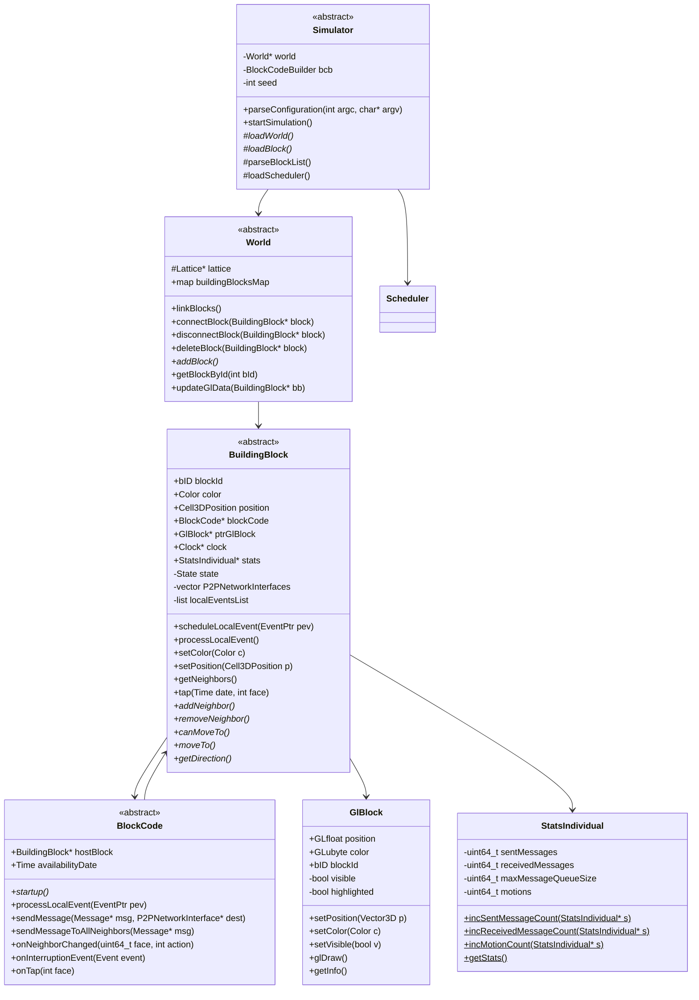
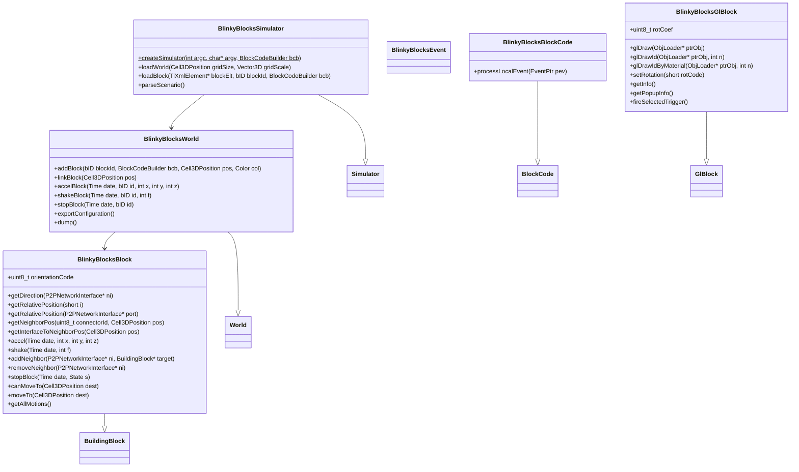
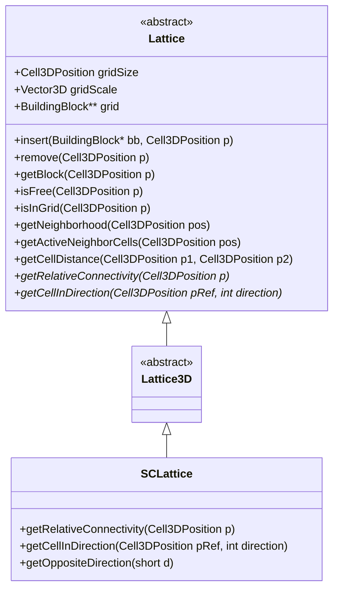
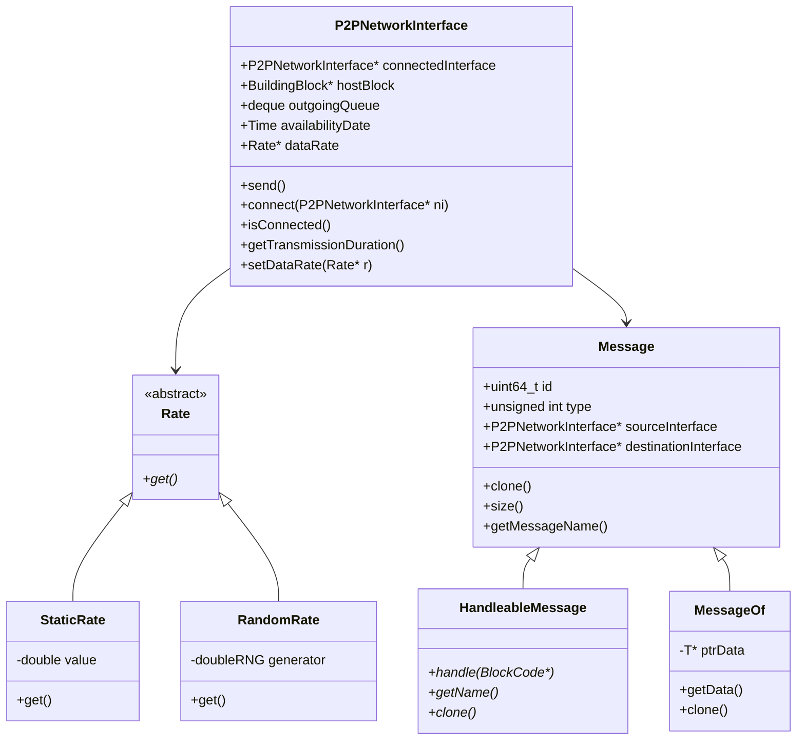
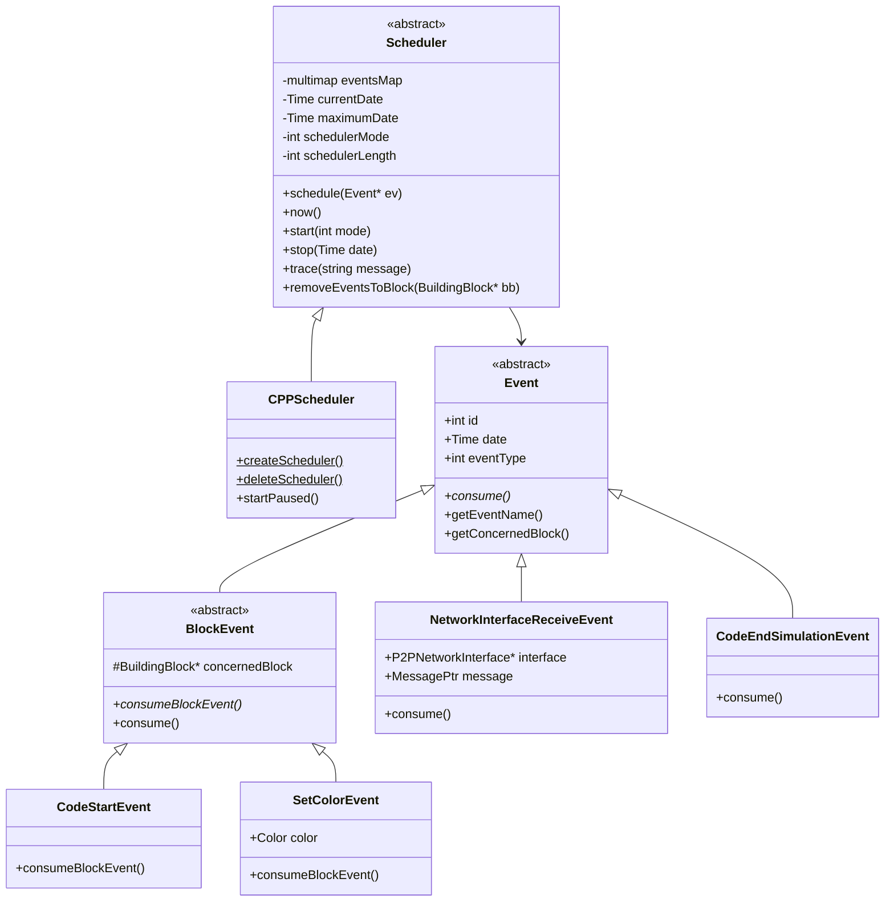
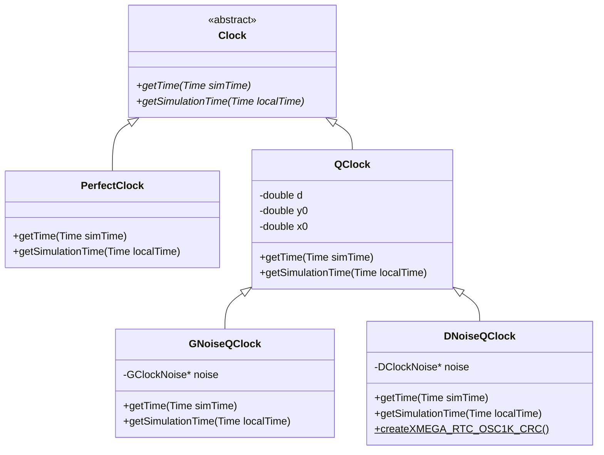

# Architecture de VisibleSim

## Classes de base

```mermaid
classDiagram
    class Simulator {
        <<abstract>>
        -World* world
        -BlockCodeBuilder bcb
        -int seed
        +parseConfiguration(int argc, char* argv)
        +startSimulation()
        #loadWorld()*
        #loadBlock()*
        #parseBlockList()
        #loadScheduler()
    }
    class World {
        <<abstract>>
        #Lattice* lattice
        +map buildingBlocksMap
        +linkBlocks()
        +connectBlock(BuildingBlock* block)
        +disconnectBlock(BuildingBlock* block)
        +deleteBlock(BuildingBlock* block)
        +addBlock()*
        +getBlockById(int bId)
        +updateGlData(BuildingBlock* bb)
    }
    class BuildingBlock {
        <<abstract>>
        +bID blockId
        +Color color
        +Cell3DPosition position
        +BlockCode* blockCode
        +GlBlock* ptrGlBlock
        +Clock* clock
        +StatsIndividual* stats
        -State state
        -vector P2PNetworkInterfaces
        -list localEventsList
        +scheduleLocalEvent(EventPtr pev)
        +processLocalEvent()
        +setColor(Color c)
        +setPosition(Cell3DPosition p)
        +getNeighbors()
        +tap(Time date, int face)
        +addNeighbor()*
        +removeNeighbor()*
        +canMoveTo()*
        +moveTo()*
        +getDirection()*
    }
    class BlockCode {
        <<abstract>>
        +BuildingBlock* hostBlock
        +Time availabilityDate
        +startup()*
        +processLocalEvent(EventPtr pev)
        +sendMessage(Message* msg, P2PNetworkInterface* dest)
        +sendMessageToAllNeighbors(Message* msg)
        +onNeighborChanged(uint64_t face, int action)
        +onInterruptionEvent(Event event)
        +onTap(int face)
    }
    class GlBlock {
        +GLfloat position
        +GLubyte color
        +bID blockId
        -bool visible
        -bool highlighted
        +setPosition(Vector3D p)
        +setColor(Color c)
        +setVisible(bool v)
        +glDraw()
        +getInfo()
    }
    class StatsIndividual {
        -uint64_t sentMessages
        -uint64_t receivedMessages
        -uint64_t maxMessageQueueSize
        -uint64_t motions
        +incSentMessageCount(StatsIndividual* s)$
        +incReceivedMessageCount(StatsIndividual* s)$
        +incMotionCount(StatsIndividual* s)$
        +getStats()$
    }

    Simulator --> World
    Simulator --> Scheduler
    World --> BuildingBlock
    BuildingBlock --> BlockCode
    BuildingBlock --> GlBlock
    BuildingBlock --> StatsIndividual
    BlockCode --> BuildingBlock
```

## BlinkyBlocks

```mermaid
classDiagram
    class BlinkyBlocksSimulator {
        +createSimulator(int argc, char* argv, BlockCodeBuilder bcb)$
        +loadWorld(Cell3DPosition gridSize, Vector3D gridScale)
        +loadBlock(TiXmlElement* blockElt, bID blockId, BlockCodeBuilder bcb)
        +parseScenario()
    }
    class BlinkyBlocksWorld {
        +addBlock(bID blockId, BlockCodeBuilder bcb, Cell3DPosition pos, Color col)
        +linkBlock(Cell3DPosition pos)
        +accelBlock(Time date, bID id, int x, int y, int z)
        +shakeBlock(Time date, bID id, int f)
        +stopBlock(Time date, bID id)
        +exportConfiguration()
        +dump()
    }
    class BlinkyBlocksEvent {
    }
    class BlinkyBlocksBlock {
        +uint8_t orientationCode
        +getDirection(P2PNetworkInterface* ni)
        +getRelativePosition(short i)
        +getRelativePosition(P2PNetworkInterface* port)
        +getNeighborPos(uint8_t connectorId, Cell3DPosition pos)
        +getInterfaceToNeighborPos(Cell3DPosition pos)
        +accel(Time date, int x, int y, int z)
        +shake(Time date, int f)
        +addNeighbor(P2PNetworkInterface* ni, BuildingBlock* target)
        +removeNeighbor(P2PNetworkInterface* ni)
        +stopBlock(Time date, State s)
        +canMoveTo(Cell3DPosition dest)
        +moveTo(Cell3DPosition dest)
        +getAllMotions()
    }
    class BlinkyBlocksBlockCode {
        +processLocalEvent(EventPtr pev)
    }
    class BlinkyBlocksGlBlock {
        +uint8_t rotCoef
        +glDraw(ObjLoader* ptrObj)
        +glDrawId(ObjLoader* ptrObj, int n)
        +glDrawIdByMaterial(ObjLoader* ptrObj, int n)
        +setRotation(short rotCode)
        +getInfo()
        +getPopupInfo()
        +fireSelectedTrigger()
    }

    BlinkyBlocksSimulator --|> Simulator
    BlinkyBlocksWorld --|> World
    BlinkyBlocksBlock --|> BuildingBlock
    BlinkyBlocksBlockCode --|> BlockCode
    BlinkyBlocksGlBlock --|> GlBlock
    BlinkyBlocksWorld --> BlinkyBlocksBlock
    BlinkyBlocksSimulator --> BlinkyBlocksWorld
```

## Applications BlinkyBlocks

```mermaid
classDiagram
    class BlinkyBlocksBlockCode {
        +processLocalEvent(EventPtr pev)
    }
    class SimpleColorCode {
        +startup()
        +myBroadcastFunc()
    }
    class E1_FloodingCode {
        +startup()
        +myBroadcastFunc()
        +parseUserBlockElements()
    }
    class E2_GoBackCode {
        +startup()
        +myGoFunc()
        +myBackFunc()
        +parseUserBlockElements()
    }
    class E3_LightPathCode {
        +startup()
        +myGoFunc()
        +myBackFunc()
        +myLightFunc()
        +parseUserBlockElements()
    }
    class BordersCode {
        +startup()
        +myPositionFunc()
        +myLeaderFunc()
        +myDistanceFunc()
        +onGlDraw()
    }
    class ChangingDistanceCode {
        +startup()
        +myDistanceMessageFunc()
        +myUpdateMessageFunc()
        +myRemoveMessageFunc()
        +onTap()
    }
    class BBbalanceCode {
        +startup()
        +myBuildSTFunc()
        +myAckCentreFunc()
        +onNeighborChanged()
    }
    class MyCSGappBBCode {
        +startup()
        +myBroadcastFunc()
        +myBackFunc()
        +onBlockSelected()
        +onUserKeyPressed()
        +onUserArrowKeyPressed()
    }
    class AntsCode {
        +startup()
        +myMoveFunc()
        +onInterruptionEvent()
    }
    class BBshapeRecognitionCode {
    }

    BlinkyBlocksBlockCode <|-- SimpleColorCode
    BlinkyBlocksBlockCode <|-- E1_FloodingCode
    BlinkyBlocksBlockCode <|-- E2_GoBackCode
    BlinkyBlocksBlockCode <|-- E3_LightPathCode
    BlinkyBlocksBlockCode <|-- BordersCode
    BlinkyBlocksBlockCode <|-- ChangingDistanceCode
    BlinkyBlocksBlockCode <|-- BBbalanceCode
    BlinkyBlocksBlockCode <|-- MyCSGappBBCode
    BlinkyBlocksBlockCode <|-- AntsCode
    BlinkyBlocksBlockCode <|-- BBshapeRecognitionCode
```

## Grille

```mermaid
classDiagram
    class Lattice {
        <<abstract>>
        +Cell3DPosition gridSize
        +Vector3D gridScale
        +BuildingBlock** grid
        +insert(BuildingBlock* bb, Cell3DPosition p)
        +remove(Cell3DPosition p)
        +getBlock(Cell3DPosition p)
        +isFree(Cell3DPosition p)
        +isInGrid(Cell3DPosition p)
        +getNeighborhood(Cell3DPosition pos)
        +getActiveNeighborCells(Cell3DPosition pos)
        +getCellDistance(Cell3DPosition p1, Cell3DPosition p2)
        +getRelativeConnectivity(Cell3DPosition p)*
        +getCellInDirection(Cell3DPosition pRef, int direction)*
    }
    class Lattice3D {
        <<abstract>>
    }
    class SCLattice {
        +getRelativeConnectivity(Cell3DPosition p)
        +getCellInDirection(Cell3DPosition pRef, int direction)
        +getOppositeDirection(short d)
    }

    Lattice <|-- Lattice3D
    Lattice3D <|-- SCLattice
```

## Communication

```mermaid
classDiagram
    class P2PNetworkInterface {
        +P2PNetworkInterface* connectedInterface
        +BuildingBlock* hostBlock
        +deque outgoingQueue
        +Time availabilityDate
        +Rate* dataRate
        +send()
        +connect(P2PNetworkInterface* ni)
        +isConnected()
        +getTransmissionDuration()
        +setDataRate(Rate* r)
    }
    class Rate {
        <<abstract>>
        +get()*
    }
    class StaticRate {
        -double value
        +get()
    }
    class RandomRate {
        -doubleRNG generator
        +get()
    }
    class Message {
        +uint64_t id
        +unsigned int type
        +P2PNetworkInterface* sourceInterface
        +P2PNetworkInterface* destinationInterface
        +clone()
        +size()
        +getMessageName()
    }
    class HandleableMessage {
        +handle(BlockCode*)*
        +getName()*
        +clone()*
    }
    class MessageOf {
        -T* ptrData
        +getData()
        +clone()
    }

    P2PNetworkInterface --> Rate
    P2PNetworkInterface --> Message
    Rate <|-- StaticRate
    Rate <|-- RandomRate
    Message <|-- HandleableMessage
    Message <|-- MessageOf
```

## Événements

```mermaid
classDiagram
    class Scheduler {
        <<abstract>>
        -multimap eventsMap
        -Time currentDate
        -Time maximumDate
        -int schedulerMode
        -int schedulerLength
        +schedule(Event* ev)
        +now()
        +start(int mode)
        +stop(Time date)
        +trace(string message)
        +removeEventsToBlock(BuildingBlock* bb)
    }
    class CPPScheduler {
        +createScheduler()$
        +deleteScheduler()$
        +startPaused()
    }
    class Event {
        <<abstract>>
        +int id
        +Time date
        +int eventType
        +consume()*
        +getEventName()
        +getConcernedBlock()
    }
    class BlockEvent {
        <<abstract>>
        #BuildingBlock* concernedBlock
        +consumeBlockEvent()*
        +consume()
    }
    class CodeStartEvent {
        +consumeBlockEvent()
    }
    class SetColorEvent {
        +Color color
        +consumeBlockEvent()
    }
    class NetworkInterfaceReceiveEvent {
        +P2PNetworkInterface* interface
        +MessagePtr message
        +consume()
    }
    class CodeEndSimulationEvent {
        +consume()
    }

    Scheduler <|-- CPPScheduler
    Scheduler --> Event
    Event <|-- BlockEvent
    Event <|-- NetworkInterfaceReceiveEvent
    Event <|-- CodeEndSimulationEvent
    BlockEvent <|-- CodeStartEvent
    BlockEvent <|-- SetColorEvent
```

## Horloges

```mermaid
classDiagram
    class Clock {
        <<abstract>>
        +getTime(Time simTime)*
        +getSimulationTime(Time localTime)*
    }
    class PerfectClock {
        +getTime(Time simTime)
        +getSimulationTime(Time localTime)
    }
    class QClock {
        -double d
        -double y0
        -double x0
        +getTime(Time simTime)
        +getSimulationTime(Time localTime)
    }
    class GNoiseQClock {
        -GClockNoise* noise
        +getTime(Time simTime)
        +getSimulationTime(Time localTime)
    }
    class DNoiseQClock {
        -DClockNoise* noise
        +getTime(Time simTime)
        +getSimulationTime(Time localTime)
        +createXMEGA_RTC_OSC1K_CRC()$
    }

    Clock <|-- PerfectClock
    Clock <|-- QClock
    QClock <|-- GNoiseQClock
    QClock <|-- DNoiseQClock
```