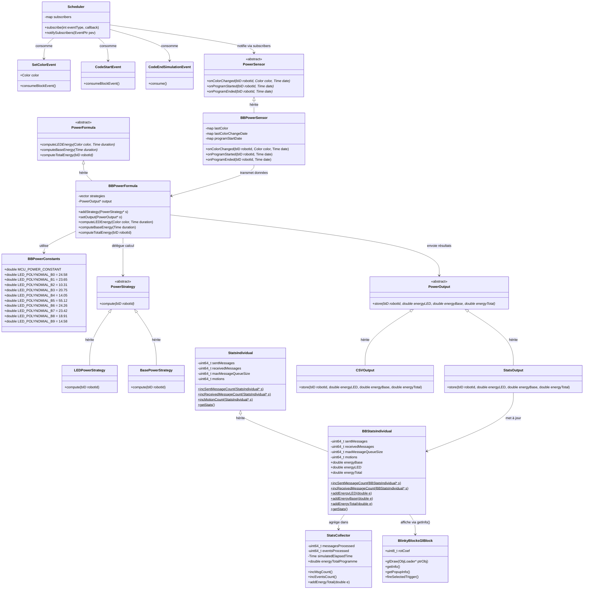

```mermaid
classDiagram
    class Scheduler {
        -map subscribers
        +subscribe(int eventType, callback)
        +notifySubscribers(EventPtr pev)
    }
    class SetColorEvent {
        +Color color
        +consumeBlockEvent()
    }
    class CodeStartEvent {
        +consumeBlockEvent()
    }
    class CodeEndSimulationEvent {
        +consume()
    }
    class PowerSensor {
        <<abstract>>
        +onColorChanged(bID robotId, Color color, Time date)*
        +onProgramStarted(bID robotId, Time date)*
        +onProgramEnded(bID robotId, Time date)*
    }
    class BBPowerSensor {
        -map lastColor
        -map lastColorChangeDate
        -map programStartDate
        +onColorChanged(bID robotId, Color color, Time date)
        +onProgramStarted(bID robotId, Time date)
        +onProgramEnded(bID robotId, Time date)
    }
    class BBPowerConstants {
        +double MCU_POWER_CONSTANT
        +double LED_POLYNOMIAL_B0 = 24.58
        +double LED_POLYNOMIAL_B1 = 23.65
        +double LED_POLYNOMIAL_B2 = 10.31
        +double LED_POLYNOMIAL_B3 = 20.75
        +double LED_POLYNOMIAL_B4 = 14.05
        +double LED_POLYNOMIAL_B5 = 55.12
        +double LED_POLYNOMIAL_B6 = 24.26
        +double LED_POLYNOMIAL_B7 = 23.42
        +double LED_POLYNOMIAL_B8 = 18.91
        +double LED_POLYNOMIAL_B9 = 14.58
    }
    class PowerStrategy {
        <<abstract>>
        +compute(bID robotId)*
    }
    class LEDPowerStrategy {
        +compute(bID robotId)
    }
    class BasePowerStrategy {
        +compute(bID robotId)
    }
    class PowerFormula {
        <<abstract>>
        +computeLEDEnergy(Color color, Time duration)*
        +computeBaseEnergy(Time duration)*
        +computeTotalEnergy(bID robotId)*
    }
    class BBPowerFormula {
        -vector strategies
        -PowerOutput* output
        +addStrategy(PowerStrategy* s)
        +setOutput(PowerOutput* o)
        +computeLEDEnergy(Color color, Time duration)
        +computeBaseEnergy(Time duration)
        +computeTotalEnergy(bID robotId)
    }
    class PowerOutput {
        <<abstract>>
        +store(bID robotId, double energyLED, double energyBase, double energyTotal)*
    }
    class StatsOutput {
        +store(bID robotId, double energyLED, double energyBase, double energyTotal)
    }
    class CSVOutput {
        +store(bID robotId, double energyLED, double energyBase, double energyTotal)
    }
    class StatsIndividual {
        -uint64_t sentMessages
        -uint64_t receivedMessages
        -uint64_t maxMessageQueueSize
        -uint64_t motions
        +incSentMessageCount(StatsIndividual* s)$
        +incReceivedMessageCount(StatsIndividual* s)$
        +incMotionCount(StatsIndividual* s)$
        +getStats()$
    }
    class BBStatsIndividual {
        -uint64_t sentMessages
        -uint64_t receivedMessages
        -uint64_t maxMessageQueueSize
        -uint64_t motions
        +double energyBase
        +double energyLED
        +double energyTotal
        +incSentMessageCount(BBStatsIndividual* s)$
        +incReceivedMessageCount(BBStatsIndividual* s)$
        +addEnergyLED(double e)$
        +addEnergyBase(double e)$
        +addEnergyTotal(double e)$
        +getStats()$
    }
    class StatsCollector {
        -uint64_t messagesProcessed
        -uint64_t eventsProcessed
        -Time simulatedElapsedTime
        +double energyTotalProgramme
        +incMsgCount()
        +incEventsCount()
        +addEnergyTotal(double e)
    }
    class BlinkyBlocksGlBlock {
        +uint8_t rotCoef
        +glDraw(ObjLoader* ptrObj)
        +getInfo()
        +getPopupInfo()
        +fireSelectedTrigger()
    }

    Scheduler --> SetColorEvent : consomme
    Scheduler --> CodeStartEvent : consomme
    Scheduler --> CodeEndSimulationEvent : consomme
    Scheduler --> PowerSensor : notifie via subscribers
    PowerSensor <|-- BBPowerSensor : hérite
    PowerStrategy <|-- LEDPowerStrategy : hérite
    PowerStrategy <|-- BasePowerStrategy : hérite
    PowerFormula <|-- BBPowerFormula : hérite
    PowerOutput <|-- StatsOutput : hérite
    PowerOutput <|-- CSVOutput : hérite
    StatsIndividual <|-- BBStatsIndividual : hérite
    BBPowerSensor --> BBPowerFormula : transmet données
    BBPowerFormula --> BBPowerConstants : utilise
    BBPowerFormula --> PowerStrategy : délègue calcul
    BBPowerFormula --> PowerOutput : envoie résultats
    StatsOutput --> BBStatsIndividual : met à jour
    BBStatsIndividual --> StatsCollector : agrège dans
    BBStatsIndividual --> BlinkyBlocksGlBlock : affiche via getInfo()
```